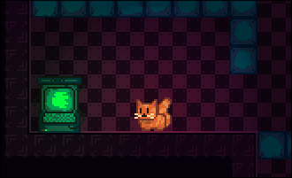

<!-- Ad Maiorem Dei Gloriam! -->
## Termformer (aka Termform, bad naming memory lol Xd)
A simple game about a cat that controls the environment with the terminal

## About
This game was made as a Proof Of Concept, to see if this mechanic works well, is nice to play and fun. I spent a LOT of time polishing the game with stretch animations, shaders and some reaaaly small QoL things that make the game more enjoyable.

For now, it has only 3 levels that are supposed to teach the basic mechanics for the game

## Input
- E interacts with objects, such as the terminal and the door
- ESC exits the terminal (May exit the fullscreen mode in itch.io, it is normal.)

## Environment
In the game, you use a terminal to control devices connected to the terminal. To list the devices with a serial connection to the terminal, you may need to use the 'ls' command.
Then, the only command by now is 'td' (Toggle Disable) followed by a numeric index (rthat you get in the 'ls' command)
These things can be used with that command
- Toggle Tiles
- Movable platforms (Are functional, but aren't on any level by now because of missing sprites)

## Future plans
- Add a sleep command and a '&&' operator to introduce timing!!
- Idk :( (Please, if you have any ideas, open a issue on github)

## AI disclosure
- AI wasn't widelly used in this project, but some architectural questions such aas handling ui on godot (eg. autoload or references?) was used for learning :)